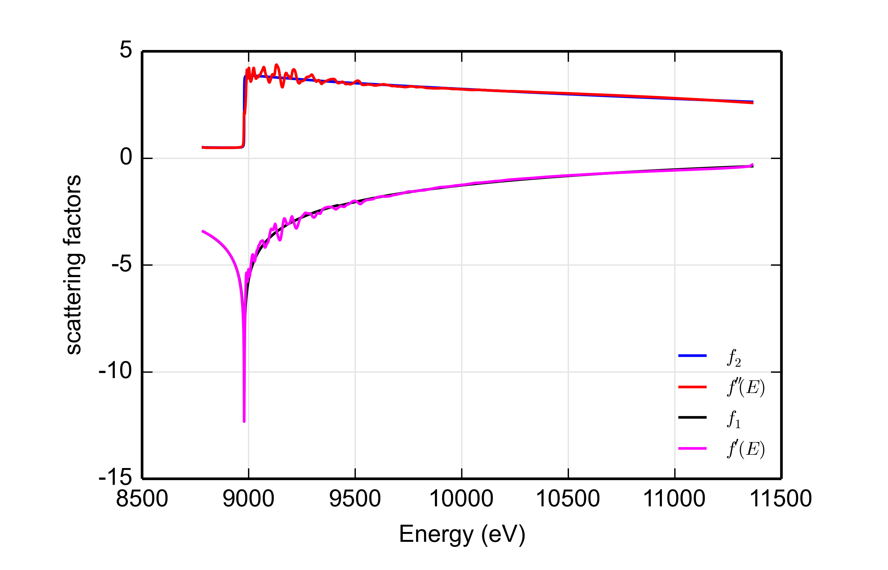

# More Hints for the Plugin Author

The diffKK plugin (at
[`plugins/xafs/diffkk.py`](https://github.com/xraypy/xraylarch/blob/master/plugins/xafs/diffkk.py))
implements the differential Kramers-Kronig transform
[suggested by Cross and Newville](http://dx.doi.org/10.1103/PhysRevB.58.11215)
using the MacLaurin series algorithm suggested by Ohta and Ishida,
Applied Spectroscopy 42:6 (1988) pp. 952-957.  This is a way of
matching experimental data to tabulated values o fthe imaginary part
of the energy-dependent correction to the Thompson scattering factor
and using a
[Kramers-Kronig transform](https://en.wikipedia.org/wiki/Kramers%E2%80%93Kronig_relations)
to generate the real part.  The advantage of this over the tabulated
values is that, starting from a measured XAS spectrum, the `diffkk`
results include the effect of the local scattering environment on the
energy-dependent scattering function.

The diffKK plugin uses  the MBACK plugin to do the matching of the
XAS data to tabulated $$f''(E)$$ data.  It also demonstrates a few
more features of Larch plugins that merit discussion in this tutorial.

## A Larch plugin implementing a Group

The MBACK plugin implements one function, which is registered to
Larch's symbol table.  This function is intended for use with an
existing data Group.

The diffKK plugin takes a slightly different approach.  It too
exposes on function to Larch's symbol table.  This function is called
`diffkk` and returns a reference to a `diffKK` Group.  Here's what
that looks like:

```python
def diffkk(energy=None, mu=None, z=None, edge='K', mback_kws=None, _larch=None, **kws):
    """
    Make a diffKK group given mu(E) data

      Attributes
        energy:     energy array
        mu:         array with mu(E) data
        z:          Z number of absorber
        edge:       absorption edge, usually 'K' or 'L3'
        mback_kws:  arguments for the mback algorithm
    """
    return diffKKGroup(energy=energy, mu=mu, z=z, mback_kws=mback_kws, _larch=_larch)
    
    
def registerLarchPlugin(): # must have a function with this name!
    return ('_xafs', { 'diffkk': diffkk })
```

and here how it is called:

```
larch> dkk = diffkk(data.energy, data.xmu, z=29, edge='K', mback_kws={'e0':8979, 'order':4})
larch> show c
== diffKK Group: 7 symbols ==
  edge: 'K'
  energy: array<shape=(612,), type=dtype('float64')>
  kk: <bound method diffKKGroup.kk of <diffKK Group>>
  mback_kws: {'e0': 8979, 'order': 4}
  mu: array<shape=(612,), type=dtype('float64')>
  plotkk: <bound method diffKKGroup.plotkk of <diffKK Group>>
  z: 29
```

The `diffkk` function created and returned a `diffKK` group, which is
called `dkk`.  This group contains the energy and $$\mu(E)$$ arrays,
the scalar values of `z` and `edge` arguments, the dictionary value of
the `mback_kws` argument, and references to a couple of functions,
`kk()` and `plotkk()`.  This really underscores the definition of a
Group being a collection of *things*.

The diffKK Group is defined in the plugin as a class which inherits
from Larch's Group.  That is, diffKK has all the propoerties of a
Larch Group *and* the additional properties given to it in this
plugin.

```python
class diffKKGroup(Group):
    """
    A Larch Group for generating f'(E) and f"(E) from a XAS measurement of mu(E).
    """

    def __init__(self, energy=None, mu=None, z=None, edge='K', mback_kws=None, _larch=None, **kws):
        kwargs = dict(name='diffKK')
        kwargs.update(kws)
        Group.__init__(self,  **kwargs)
        self.energy     = energy
        self.mu         = mu
        self.z          = z
        self.edge       = edge
        self.mback_kws  = mback_kws

        if _larch == None:
            self._larch   = Interpreter()
        else:
            self._larch = _larch

    def __repr__(self):
        return '<diffKK Group>'
```

In typical fashion, the class has a document string.  The `__init__`
method of the class is defined and used to initialize various
attributes of the class.  Most of these attributes are the things that
will be needed to perform the differential KK transform.  It also
defines a `_larch` reference which will point at the correct value of
the Larch interpreter.

The `__repr__` method is also specified so that the class has an
unambiguous string representation:

```
larch> print dkk
<diffKK Group>
```

The plugin then goes on to define the `kk()` and `plotkk()`
functions.  These perform the KK transform and plot the results.
These commands

```
larch> dkk.kk()
larch> dkk.plotkk()
```

post this plot to the screen:



The `kk()` function places additional arrays and scalars in the `dkk`
Group.

This kind of plugin -- one which defines a Group and stores a tightly
connected, curated collection of data and function references -- is
very handy.  It makes a nice, neat package for an analysis concept.
See
[the section on Feff paths from the Larch document](http://xraypy.github.io/xraylarch/xafs/feffpaths.html)
for several more examples of this sort of plugin.

## Using NumPy effectively

The diffKK plugin also makes effective use of NumPy's vectorized
calculations.  At the heart of the diffKK algorithm is a
computationally intensive KK transform.  Here is a scalar
implementation of the MacLaurin series algorithm

```python
def kkmclr_sca(e, finp):
    """
    reverse (f''->f') kk transform, using maclaurin series algorithm
    """
    npts = len(e)
    fout = [0.0]*npts

    factor = -FOPI * (e[npts-1] - e[0]) / (npts - 1)
    nptsk  = npts / 2
    for i in range(npts):
        fout[i] = 0.0
        ei2 = e[i]*e[i]
        ioff = i%2 - 1
        for k in range(nptsk):
            j = k + k + ioff
            de2 = e[j]*e[j] - ei2
            if abs(de2) <= TINY:
                de2 = TINY
            fout[i] = fout[i] + e[j]*finp[j]/de2
        fout[i] *= factor
    return fout
```

(I have removed most of the document string and all of the exception
handling for the sake of bevity.)

This has nested loops over the entire range of the arrays containing
the data to be transformed.  While the inner loops is smaller by a
factor of 2 than the outer loop, this is effectively of order
$$(n^2)$$ in calculation time.  It scaled very poorly in time as the
arrays become large.

Here is how this is implemented in diffKK:

```python
def kkmclr(e, finp):
    """
    reverse (f''->f') kk transform, using maclaurin series algorithm
    """
    npts = len(e)

    fout   = np.zeros(npts)
    factor = -FOPI * (e[-1] - e[0]) / (npts-1)
    ei2    = e**2
    ioff   = np.mod(np.arange(npts), 2) - 1

    nptsk  = npts/2
    k      = np.arange(nptsk)

    for i in range(npts):
        j    = 2*k + ioff[i]
        de2  = e[j]**2 - ei2[i]
        fout[i] = sum(e[j]*finp[j]/de2)

    fout = fout * factor
    return fout
```

Here NumPy's vectorization is used to remove the inner loop.
Calculations are made on entire vectors rather than by iterating over
the elements of the inner loop.  The iteration still happens, but it
is done behind the scenes using NumPy's efficient vectorization.  This
is not quite as fast an order $$n$$ calculation, but it is much faster
than the scalar implementation above.  On the modest and fairly old
computer I am sitting at to write this, the scaler calculationtakes
about 15 second while the vectorized calculation takes under 2
seconds.

Take the time to understand how this stuff works!
