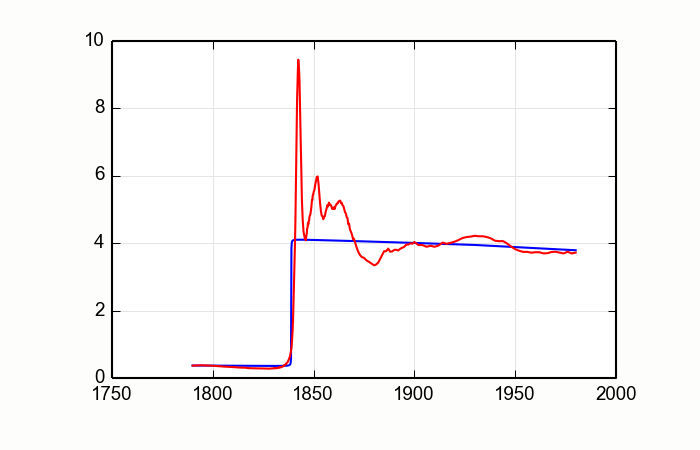
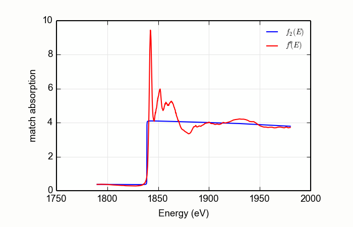

# The tricky details

In the Larch document, Groups
[are described here](http://xraypy.github.io/xraylarch/tutorial/datatypes.html#groups).
In that section, you are told that to make your own Groups, you use
the `group()` function.  While that is certainly correct practice at
the Larch command line, you have no doubt noticed that the `params`
Group was created using the `Group()` function.

Similarly, the Larch
[tells us](http://xraypy.github.io/xraylarch/fitting/parameters.html)
that the `param()` function is used to make fitting parameters.  Yet,
the `Parameter()` function was used throughout this example.

And what is that `_larch` thing littering the entire MBACK plugin?


It turns out that there are some substantive differences between how
Larch is used at the command line and how Larch is used when writing a
plugin.  For me, these differences represented a large and confusing
hurdle when I first began working with Larch.  Helping you understand
these tricky but essential details is the main reason for writing this
tutorial.

## Function names, symbol names, and the Larch interpreter

Suppose that you want to include a function in your plugin for
plotting the result of the MBACK calculation.  At the larch command
line, you might type something like this to make a quick-n-dirty plot
showing the tabulated cross-section along with the matched data.

```
larch> newplot(data.energy, data.f2)
larch> plot(data.energy, data.fpp)
```

You might then think that a function like this would be a cool idea

```python
 ### !!! Note: this is not correct!!!!
def plot_mback(group=None):
	"""Quick-n-dirty plot of MBACK calculation"""
	newplot(group.energy, group.f2)
	plot(group.energy, group.fpp)
```

and finish the plugin off by exporting your new function:


```python
def registerLarchPlugin(): # must have a function with this name!
    return ('_xafs', { 'mback': mback,
                       'plot_mback': plot_mback })
```

Go ahead!  Edit the `plugins/xafs/mback.py` file on your computer and
give it shot at the Larch command line.

You will be disappointed.

In fact, here is what happens:

```
larch> plot_mback(a)
  File "/usr/local/share/larch/plugins/xafs/mback.py", line 162, in plot_mback
    newplot(group.energy, group.f2)file <stdin>, line 0
NameError: global name 'newplot' is not defined
    plot_mback(a)
```

Say what?  Of course `newplot` is defined!  We use it all the time at
the Larch command line!

To understand the first reason why that function won't work, let's
examine the plugin that implements plotting:
[plugins/wx/plotter.py](https://github.com/xraypy/xraylarch/blob/master/plugins/wx/plotter.py).
Like all plugins, it ends with a call to `registerLarchPlugin`.  It
says, in part,

```python
def registerLarchPlugin():
	return (MODNAME, {'plot':_plot,
                      'oplot':_oplot,
	                  'newplot':_newplot,
```

followed by over a dozen more symbol definitions.  `MODNAME` is
defined above as

```python
MODNAME = '_plotter'
```

So that call to `registerLarchPlugin` puts several symbols into the
`_plotter` group.  The function `_plot` is gaven the symbol name
`plot`.  Unlike the example given in the MBACK plugin, the function
name and the symbol name *are not the same!*

The symbol name is how the users accesses the function from the Larch
command line.  However, when authoring a plugin -- when *programming*
with Larch -- you do not have access to the symbol name in the same
way.  To use a function, you must use the function name.

So how is this done in practice?  First, you need to import the
function name into your plugin.  Near the top of the file containing
theplugin, you would need something like this (you should continue
editing the plugin file):

```python
use_plugin_path('wx')
from plotter import _newplot, _plot
```

This makes those plotting functions available to your plugin.  After
inlcuding that at the top of the file, you might then change the
`plot_mback` function to

```python
 ### !!! Note: this is still not quite correct!!!!
def plot_mback(group=None):
	"""Quick-n-dirty plot of MBACK calculation"""
	_newplot(group.energy, group.f2)
	_plot(group.energy, group.fpp)
```

Now, when you try to make the plot, this happens:

```
larch> a=read_ascii('/home/bruce/Talc.xmu')
larch> mback(a.e, a.xmu, group=a, z=14, edge='K', order=2, whiteline=50, fit_erfc=True)
larch> plot_mback(a)
  File "/usr/local/share/larch/plugins/xafs/mback.py", line 162, in plot_mback
    _newplot(group.e, group.f2)
  File "/usr/local/lib/python2.7/dist-packages/larch/__init__.py", line 35, in wrapper
    raise LarchPluginException(errmsg % fcn.__name__)file <stdin>, line 0
LarchPluginException: plugin function '_newplot' needs a valid '_larch' argument
    plot_mback(a)
```

That's a bit cryptic.

It turns out that the Larch interpreter is, itself, an instance of
python object.  It is possible to have more that one in existance at
any time.  The function needs to somehow know that it is supposed to
use the same instance of the interpreter that is being used at the
command line you are interacting with.  Here is how that is done:

```python
def plot_mback(group=None, _larch=None):
    """Quick-n-dirty plot of MBACK calculation"""
    _newplot(group.e, group.f2, _larch=_larch)
    _plot(group.e, group.fpp, _larch=_larch)
```

Yay!  Success!



The argument list takes an argument called `_larch`, which defaults to
None.  That argument is then passed to the calls to `_newplot` and
`_plot`.  When Larch finds that the `_larch` argument is an actual
interpreter, it will use it.  When the `_larch` argument is None,
Larch will use the default interpreter.  When you are working from the
command line, the command line interpreter is the default interpreter.

Of course, that function is a bit unprofessional.  Let's make it a bit
spiffier.

```python
def plot_mback(group=None, _larch=None):
    """Quick-n-dirty plot of MBACK calculation"""
    _newplot(group.e, group.f2, _larch=_larch, xlabel='Energy (eV)', ylabel='match absorption',
	         label='$f_2(E)$', show_legend=True, legend_loc='ur')
    _plot(group.e, group.fpp, _larch=_larch, label="$f''(E)$")
```

Lovely!



## Symbol names and the Larch interpreter in the MBACK function

